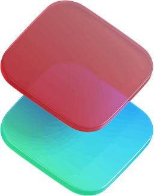

<div align="center">

<br>



# SwiftSelect

Capture, copy, and download in a single motion.

<br>

[](https://chromewebstore.google.com/detail/swiftselect-capture-copy/aboceojignbeaclebdpjjgkocmdldoec)

The fastest screenshot tool for Chrome. Select a region, grab the viewport, or scroll-capture an entire page. Everything lands on your clipboard automatically.

</div>

<br>

---

<br>
<div align="center">
  
</div>

<br>
## The Mechanics of SwiftSelect

Most screenshot extensions are slow, cluttered, or demand unnecessary sign-ups. SwiftSelect does exactly three things and executes them instantly.

| Mode | Action | Output |
| :--- | :--- | :--- |
| Region Select | Draw a box around any element | Copied to clipboard |
| Visible Area | Capture the current viewport | Copied to clipboard and optional download |
| Full Page | Scroll and stitch the entire page | Saved as a file |

Full-page capture reliably processes complex single-page applications, bypassing sticky headers and fixed elements.

<br>
<div align="center">
  
</div>

<br>
## Shortcuts

Every action has a dedicated shortcut to eliminate toolbar hunting.

| Shortcut | Action |
| :--- | :--- |
| <kbd>Alt</kbd> + <kbd>X</kbd> | Activate SwiftSelect and open the floating toolbar |
| <kbd>Alt</kbd> + <kbd>S</kbd> | Capture visible area and download |
| <kbd>Alt</kbd> + <kbd>F</kbd> | Capture full page and download |
| <kbd>Esc</kbd> | Cancel and close |

Clicking the extension icon in the toolbar also activates region selection mode directly.

<br>

## Selection Modifiers

While dragging a region selection, hold a modifier key to alter the capture behavior.

| Hold | Effect |
| :--- | :--- |
| <kbd>Shift</kbd> | Constrain to a perfect square |
| <kbd>Space</kbd> | Reposition the selection box mid-drag |
| <kbd>Ctrl</kbd> / <kbd>⌘</kbd> + hover | Auto-detect elements like images or cards, then click to capture |

<br>

## Theming

The floating toolbar includes a toggle for light and dark modes. The interface also supports a liquid glass aesthetic. Preferences persist across sessions.

<br>

## Installation

### 🌐 Chrome Web Store (Recommended)

<a href="https://chromewebstore.google.com/detail/swiftselect-capture-copy/aboceojignbeaclebdpjjgkocmdldoec">
  
</a>

### 📦 From Releases

1. Navigate to the [Releases](https://github.com/arsalan06106/SwiftSelect-capture-copy-download-screenshots/releases) page and download the latest `.zip` file.
2. Extract the downloaded archive to a permanent folder on your local machine.
3. Open `chrome://extensions/` in your browser.
4. Enable Developer mode using the toggle in the top right corner.
5. Click Load unpacked and select the extracted folder.
6. Pin SwiftSelect from the extensions menu.

### 💻 From Source

```bash
git clone https://github.com/arsalan06106/SwiftSelect-capture-copy-download-screenshots.git
```

1. Open `chrome://extensions/`
2. Enable Developer mode using the toggle in the top right corner.
3. Click Load unpacked and select the cloned repository directory.
4. Pin SwiftSelect from the extensions menu.

<br>

<details>
<summary>Project Structure</summary>

<br>

```text
SwiftSelect/
├── manifest.json            # Extension config (MV3)
├── background.js            # Service worker — command routing, offscreen doc management
├── contentScript.js         # Entry point injected into pages, loads src/ modules
├── popup.html               # Extension popup UI
├── popup.js                 # Popup button handlers
├── menu.html                # Context menu UI
├── menu.js                  # Menu theme toggle & button interactions
├── offscreen.html           # Offscreen document shell (MV3 clipboard/tabCapture)
├── offscreen.js             # Offscreen logic — full-page stitching & clipboard ops
├── styles.css               # All overlay, toolbar & selection styles
├── src/
│   ├── ui.js                # Toolbar & overlay rendering
│   ├── events.js            # Input & event handling (drag, modifiers, element detection)
│   ├── theme.js             # Light/dark theme logic
│   └── capture/
│       ├── region.js        # Region & visible-area capture engine
│       ├── fullpage.js      # Scroll-capture with sticky-element neutralisation
│       ├── download.js      # File-save & status-bar transition logic
│       └── utils.js         # Shared helpers (image loading, smart filenames, cursor toggle)
└── icons/                   # Extension icons (48px, 128px)
```

</details>

<details>
<summary>Permissions Justification</summary>

<br>

| Permission | Reason |
| :--- | :--- |
| `activeTab` | Access the current tab to capture content |
| `scripting` | Inject the capture overlay into pages |
| `tabs` | Query tab state for multi-step captures |
| `tabCapture` | Capture visible tab content as an image |
| `clipboardWrite` | Copy screenshots to clipboard automatically |
| `offscreen` | Create an offscreen document for clipboard API (MV3 requirement) |
| `storage` | Persist user preferences |
| `<all_urls>` | Operate on any webpage |

Declared under `host_permissions` in Manifest V3.

</details>

<br>

## Contributing

If you discover an anomaly or have a feature concept, [open an issue](https://github.com/arsalan06106/SwiftSelect-capture-copy-download-screenshots/issues). Pull requests are evaluated and welcome.

<br>

## License

[MIT](LICENSE.txt) © 2026 [arsalan06106](https://github.com/arsalan06106)

<br>

---

<div align="center">

<br>

Built by <a href="https://github.com/arsalan06106">@arsalan06106</a>

If SwiftSelect saves you time, consider leaving a ★ on the repository.

<br>

</div>
